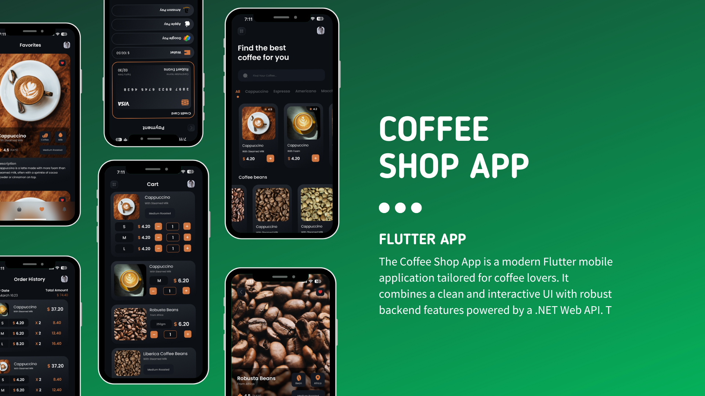

# ☕ Coffee Shop App

## Overview  
The **Coffee Shop App** is a modern Flutter mobile application tailored for coffee lovers. It combines a clean and interactive UI with robust backend features powered by a .NET Web API. This app demonstrates solid architecture, secure authentication, and smooth state management to deliver a seamless shopping experience.

---

## Features

- **Product Catalog**
  - Displays a dynamic list of available coffee products with images, sizes, and prices.
  - Product data is fetched from a .NET Web API.

- **Secure Authentication**
  - User registration and login using **hashed passwords**.
  - **OTP verification** via email during registration for extra security.
  - Secure token-based login handling via `SharedPreferences`.

- **State Management**
  - Uses **Provider** for efficient state handling across the app.
  - Smooth state updates for cart, user session, and product details.

- **Shopping Cart & Checkout**
  - Add and manage multiple items in the cart with size selection.
  - Send cart data to the backend to generate **invoices**.
  - Automatically clears the cart upon successful invoice creation.

- **Invoice System**
  - Each order creates a backend invoice.
  - Invoice details (items, total, time) are saved and **sent via email** to the customer.

- **Persistent Login**
  - Saves user login state using **SharedPreferences**.
  - Remembers the session securely even after app restart.

- **Responsive UI**
  - Built with reusable Flutter widgets for a clean, responsive layout.
  - Includes animations and loading indicators for a modern experience.

---

## Installation

1. Clone the repository:
   ```bash
   git clone https://github.com/omaratta2001/coffee-shop-app.git
   cd coffee-shop-app
